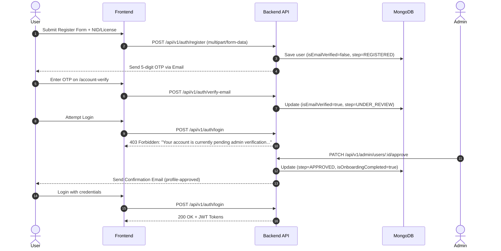

# ⚙️ British Smokes — Backend API Server

High-performance, scalable backend server built with **Node.js**, **Express**, **TypeScript**, **MongoDB (Mongoose)**, **Redis**, **BullMQ**, and **Socket.IO**.

---

## 🌟 Architecture & Highlights

- **Clean Layered Architecture**: Clean separation between `core`, `infrastructure`, `modules`, `routes`, and `shared`.
- **Identity Verification & KYC System**: Document upload (NID / Driving License) with age restriction (18+), email OTP verification, and strict admin approval enforcement.
- **Role-Based Access Control (RBAC)**: Fine-grained permissions for `USER`, `ADMIN`, and `SUPER_ADMIN`.
- **Realtime Layer**: Socket.IO integration for live notifications, push updates, and chat.
- **Asynchronous Task Processing**: Redis + BullMQ for background job queues (email notifications, push notifications).
- **Payment Processing**: Stripe integration with secure webhook verification.
- **Robust Validation & Error Handling**: Strict request payload validation using [Zod](https://zod.dev/) and centralized normalized error handling

---

## 🔐 Authentication & KYC Workflow



---

## 📁 Backend Directory Layout

```text
backend/src/
├── config/             # App & environment configuration
├── core/               # AppError, HTTP Status codes, constants, messages
├── infrastructure/     # Database, Redis, Mail (EJS), Sockets, BullMQ, Winston Logger
├── modules/            # Domain Feature Modules
│   ├── admin/          # Admin user approval & operations
│   ├── auth/           # Login, Register, OTP, JWT token generation
│   ├── user/           # User schema, KYC identity documents, repositories
│   ├── products/       # Products catalog & stock
│   ├── category/       # Category taxonomy
│   ├── brands/         # Brand definitions
│   ├── orders/         # Order creation & state machines
│   ├── payments/       # Stripe checkout & webhooks
│   ├── cart/           # Shopping cart persistence
│   ├── notification/   # In-app notifications & push dispatch
│   └── wishlist/       # User wishlist items
├── routes/             # Central API router (/api/v1)
├── shared/             # Middlewares (auth, upload, rateLimit, validation)
├── app.ts              # Express application configuration
└── server.ts           # HTTP server bootstrapping
```

---

## 🛠️ Core Scripts

- `npm run dev` — Start development server with live reload (`nodemon` + `ts-node`)
- `npm run build` — Compile TypeScript and resolve path aliases
- `npm run start` — Run production build
- `npm run test` — Run Jest test suite
- `npm run lint` — Check code with ESLint
- `npm run format` — Format code with Prettier

---

## 🔑 Environment Variables (`.env`)

```env
PORT=5000
NODE_ENV=development
DATABASE_URL=mongodb://localhost:27017/businessmyway
REDIS_URL=redis://localhost:6379

JWT_ACCESS_SECRET=your_jwt_access_secret
JWT_ACCESS_EXPIRY=15m
JWT_REFRESH_SECRET=your_jwt_refresh_secret
JWT_REFRESH_EXPIRY=7d

SMTP_HOST=smtp.mailtrap.io
SMTP_PORT=2525
SMTP_USER=your_smtp_username
SMTP_PASS=your_smtp_password
EMAIL_FROM=no-reply@businessmyway.com

STRIPE_SECRET_KEY=sk_test_...
STRIPE_WEBHOOK_SECRET=whsec_...
```
